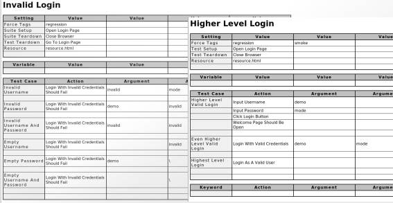
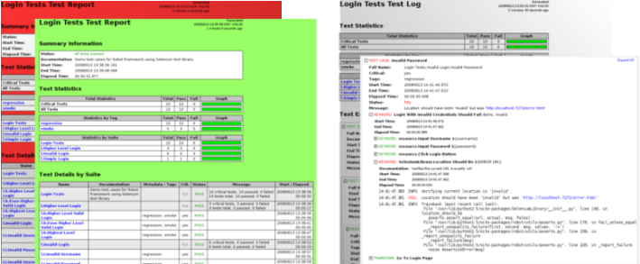

# 1.1 介绍

Robot Framework是一个基于Python的,可扩展的关键字驱动的测试自动化框架。它是为了端到端的验收测试\(End-To-End Acceptance Test\)以及验收测试驱动开发\(Acceptance-Test-Driven Development, ATDD\)而设计。
因此它可以应用于测试，当验证需要涉及多个不同技术和接口的分布式、异构的应用程序。

## 1.1.1 为什么选择Robot Framework?

* 提供了一种统一的，易于使用的表格化语法来创建测试用例;
* 提供了一种可以从已存在的关键字中创建可重复使用的高阶关键字的能力;
* 提供了HTML格式可读性强的测试报告和日志;
* 平台和应用无关性;
* 提供了一个简单的库API：用于创建用户自己的测试库，测试库可以使用原生的Python或者Java实现;
* 提供了命令行接口以及基于XML的结果输出文件，方便与已存在的构建设施集成\(持续集成系统\);
* 支持Selenium的Web测试，Java GUI测试，运行过程，Telnet, SSH等等;
* 支持创建数据驱动的测试用例;
* 内置变量功能，适用于测试不同的环境;
* 提供了标签功能，用于分类和选择测试用例执行;
* 易于与源码控制集成：测试套件都只是文件和目录可以与生产代码进行版本控制;
* 提供了测试用例和测试套件级别的Setup和Teardown;
* 模块化的结构支持为具有几个不同接口的应用程序创建测试;

## 1.1.2 顶层架构

Robot Framework 是一款通用的，应用和技术独立的框架。它具有高度模块化的结构，如下图所示：

Robot Framework Architecture

测试数据\(Test Data\)是以简单的，易于编辑的表格格式。当Robot Framework启动时，它会处理测试数据，执行测试用例然后生成测试日志和报告。
核心框架不需要关心测试用例的目的，以及用例与测试库的交互处理过程。测试库可以直接使用应用程序接口或者使用更底层的工具来作为驱动程序。

## 1.1.3 截图

以下截图样例展示了测试数据，测试报告以及日志的呈现形式。

Test Case files

Reports and Logs

## 1.1.4 获取更多信息

**项目主页**

了解更多关于Robot Framework框架和它的生态系统的首要选择是官方网站: [http:\/\/robotframework.org](http://robotframework.org)。Robot Framework框架本身托管在 [GitHub](https://github.com/robotframework/robotframework) 上。

**邮件列表**

